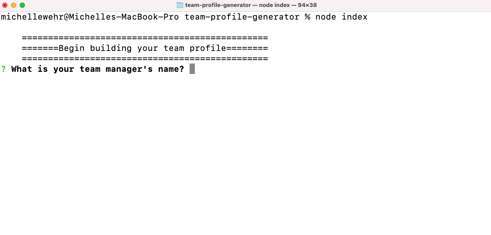
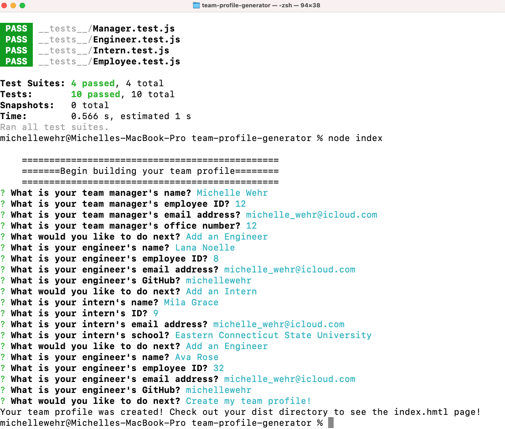
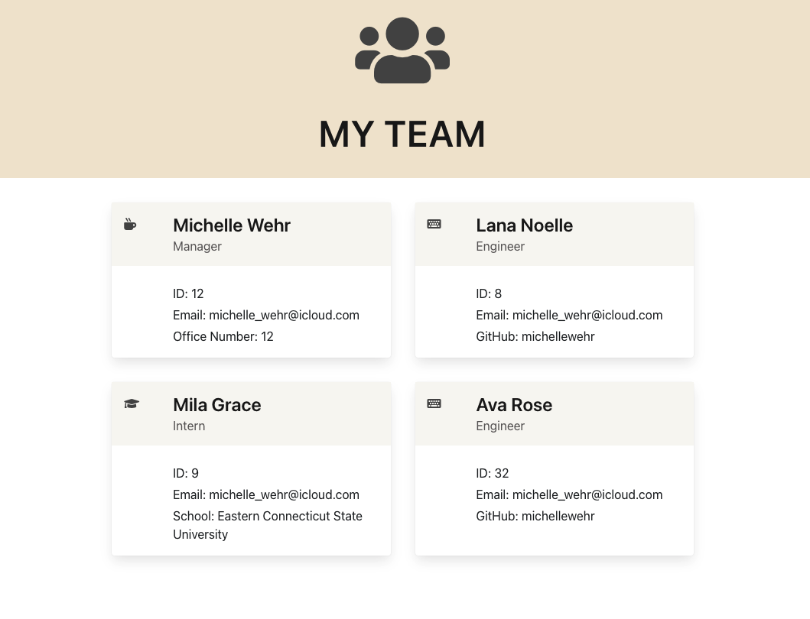

# Team Profile Generator

## Description

- This application is intended to get user input through the command line with prompts about members of their work team. Users will run the application in their computer's terminal and be prompted for their manager's information, engineers' information, and intern information. The app takes that input and creates a HTML file formatted with cards to display each team members information.

[Walkthrough Video](https://watch.screencastify.com/v/MjwIdLnbBpMryAjrXC0p)

## Installation

Clone the repository to your local computer and navigate to the repo in your terminal. Simply run 'node index' from the root of the directory to run the application and begin the prompts.

## Usage

The purpose of this application is for users to be able to easily create a team profile (HTML file) to display their teammate's work information, such as their name, employee id, and email. The application will be initiated through the user's command line and questions will be asked and answered in the command line. Prompts vary depending on which team member the user is entering. For example, in addition to the above prompts, for managers, users will also be asked manager's office number. For engineers, users will be prompted to provide the above information, but instead of office number, will be asked for the engineer's github username. For interns, users will be asked for the intern's school, in addition to name, employee, id and email. User input will be returned into a formatted HTML file, displaying team member information in cards.

The following image is an example team profile that was created with this application.

## Built with:

- Node.js
- CSS
- Bulma

## This application can be found:

- [Repository](https://github.com/michellewehr/team-profile-generator)
- As a reminder, clone the repository to your local computer, navigate to the repository in your terminal and run 'node index.js' to initialize the application.

## Contribution

Anyone is welcome to contribute to this project. To do so, clone the local repository to your local workspace, create a git feature branch and request a pull request. Upon review, the pull request will then be accepted or denied.

## Sources

- This project was inspired by UCONN's School of Engineering Coding Bootcamp.

## Author

Michelle Wehr
